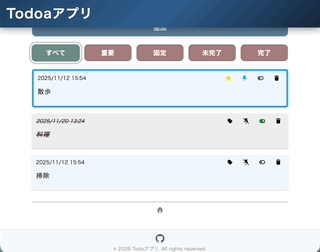

# BBS App (Firebase + Redux Toolkit)

Firebase Firestoreをバックエンドに、Redux Toolkitを状態管理に採用した、スケーラブルでメンテナンス性の高い掲示板アプリケーションです。

## 🚀 技術スタック

- **Frontend**: React, Redux Toolkit
- **Backend**: Firebase Firestore (NoSQL)
- **Testing**: Vitest, @testing-library/react, @testing-library/user-event
- **Utilities**: `date-fns` (日付フォーマット), `history` (ルーティング管理)

---

## デモ / リンク

- 

---

## 🏗 アーキテクチャ構成

「関心の分離（Separation of Concerns）」を徹底するため、以下の3レイヤー構造を採用しています。

### 1. Model レイヤー (`/src/models`)

Firestoreとの直接的なやり取りとデータ整形をカプセル化し、ビジネスロジックをUIから切り離しています。

- **Data Mapping**: サーバーデータをプレーンなオブジェクトへ変換し、ドメインモデルとしての整合性を担保。
- **Error Handling**: `BaseModelError` を継承した独自エラークラスを実装。Firestore特有のエラーを、アプリケーション層で扱いやすいドメインエラーへマッピングしています。

### 2. Redux レイヤー (`/src/redux`)

アプリケーションのグローバル状態と複雑な非同期ロジックを一元管理。

- **Thunks**: `createModelThunk` ユーティリティにより、非同期処理のライフサイクル（Pending/Fulfilled/Rejected）を標準化。
- **Middleware**: `snackbarMiddleware` を実装。各Thunkの `Rejected` アクションを自動検知し、横断的なエラー通知処理を実現しています。

### 3. Components & Hooks レイヤー

UIとロジックを分離する **Custom Hooksパターン** を採用し、コンポーネントの肥大化を防いでいます。

---

## 🎨 UI Components & Hooks Architecture

Atomic Designの思想を取り入れ、再利用性とメンテナンス性を最大化しています。

### 1. コンポーネントの階層構造

- **Common (Atom/Molecule)**: デザインシステムに準拠した最小単位。
  - **Button**: `variant` によるスタイル統一管理。
  - **Modal & SimpleSnackbar**: MUIをベースに、アクセシビリティ（WAI-ARIA）を考慮した独自ラップ。
- **Widgets (Organism)**: 特定のビジネスロジックを持つ複合コンポーネント。
  - **MessagesList**: データ描画、削除確認フロー、Loading状態の切り替えを統合。
  - **BaseTextBox**: 投稿・作成の両面で利用される入力基盤。
- **Page**: `MainPage` 等のページ単位の構成と、データフェッチのトリガーを担当。

### 2. ビジネスロジックの抽出 (Custom Hooks)

- **useMainPage**: URLパラメータとStateの同期、不正パスからの自動リダイレクト、削除処理中のSnackbar抑制など、エッジケースを考慮したガードロジックを実装。
- **useChannelForm**: 送信制限（`canPost`）の監視、バリデーション、非同期処理の順序制御（`unwrap`）をカプセル化。
- **useSideMenu**: チャンネル一覧の取得と削除モーダルの複雑な状態遷移をUIから分離。

---

## 🧪 テスト戦略 (Quality Assurance)

品質を定量的に担保するため、Vitestを用いてピラミッド型テスト（Unit, Integration, Hook Tests）を実装しています。

### 1. Custom Hook 統合テスト (`renderHookWithStore`)

独自のテストユーティリティを構築し、Reduxストアの状態変化を伴う実用的なテストを実施。

- **副作用の検証**: 特定条件下でのみ `showSnackbar` がdispatchされるかなど、ロジックの正確性を追跡。
- **クリーンアップの検証**: コンポーネントのアンマウント時に適切にStateが初期化されるかを保証。

### 2. UIコンポーネントの挙動検証

- **レンダリング整合性**: `isLoading` フラグに応じたUIの切り替えや、スナップショットテストによるレイアウト保護。
- **ユーザーフロー**: `userEvent` を用い、ボタン押下からモーダル表示、dispatch発火までのインタラクションを網羅。

### 3. モック戦略

- **Thunkのモック**: `vi.spyOn` と `unwrap` のモック実装により、非同期処理の成否がUIに与える影響を精緻にカバー。
- **境界分離**: `vi.mock` による子コンポーネントのスタブ化で、テスト対象の責務を限定し、保守性の高いテストコードを記述。

---

## 📂 ディレクトリ構造

```text
src
├── components
│   ├── common/      # 汎用UIパーツ（Button, Modal, Snackbar）
│   ├── layout/      # SideMenu, Header, Footer
│   ├── page/        # ページコンポーネントとガードロジック
│   └── widgets/     # 機能パーツ（Form, MessageCard, TextBox）
├── models/          # Firestoreデータモデル・エラー定義
├── redux/
│   ├── features/    # Slice, Thunk, Selector
│   ├── middleware/  # snackbarMiddleware (横断的関心事)
│   └── store/       # Store構成
└── test/            # 各レイヤーに対応したテスト・Fixtures
```
